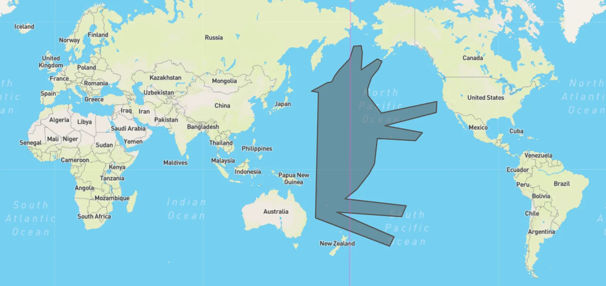

# antimeridian

[](https://pkg.go.dev/github.com/go-geospatial/antimeridian)
[](https://goreportcard.com/report/github.com/go-geospatial/antimeridian)

Package `antimeridian` fixes shapes that cross the antimeridian.



Lines and Polygons that cross the antimeridian are problematic for many web
mapping packages and PostGIS. The official [GeoJSON
spec](https://datatracker.ietf.org/doc/html/rfc7946#section-3.1.9) recommends
features that cross the antimeridian, "SHOULD be represented by cutting it in
two such that neither part's representation crosses the antimeridian."

This package will cut polygons and multi-polygons that cross the anti-meridian
into multiple polygons that do not cross the anti-meridian. It will also force
polygons to use the right-hand rule for polygon winding. Exterior rings must
be wound in counter-clockwise order and interior rings are wound clockwise.

## Usage

```shell
go get github.com/go-geospatial/antimeridian
```

Then:

```go
fixedGeom := antimeridian.Cut(geomCrossingAntiMeridian)
```
